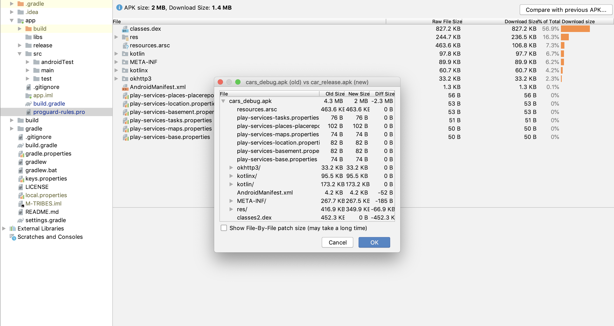
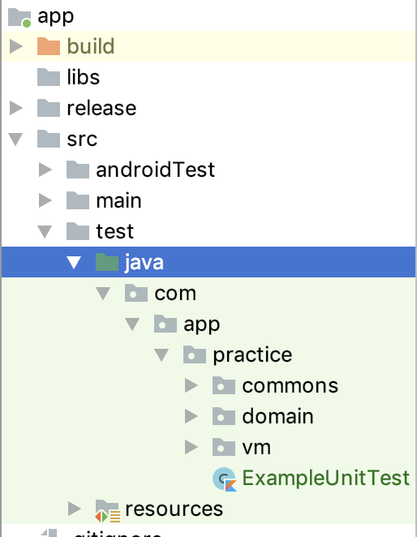
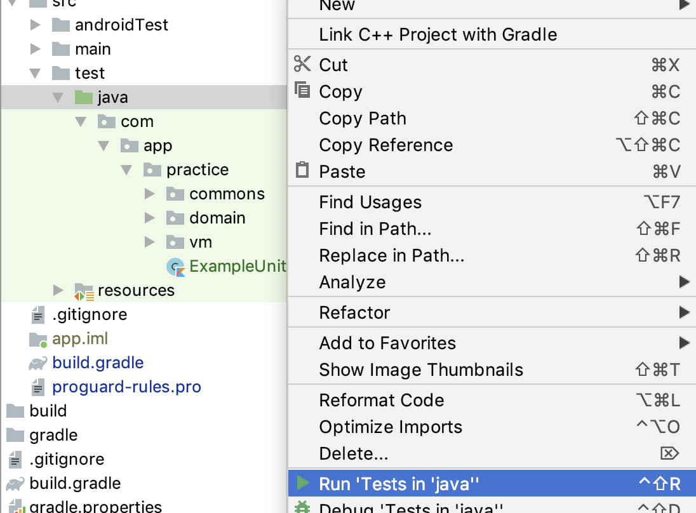

# Cars

The application contains cars information in a list and in map with tapping a car on the map to
disappear other cars and tapping again to show the hidden car again.

# Demo

## Languages, libraries and tools used

* __[Kotlin](https://developer.android.com/kotlin)__
* __[Kotlin Coroutines](https://kotlinlang.org/docs/reference/coroutines-overview.html)__
* __[Koin](https://github.com/InsertKoinIO/koin)__
* __[Android Material Design](https://material.io/components/)__
* __[Google Maps](https://developers.google.com/maps/documentation/android-sdk/intro)__ Google Maps
* __[Android Architecture Components](https://developer.android.com/topic/libraries/architecture/index.html)__
* __[Instrumented Unit Testing](https://developer.android.com/training/testing/unit-testing/instrumented-unit-tests)__

Above Features are used to make code simple, generic, understandable, clean and easily maintainable
for future development. Especially **Koin** for dependency injection and **Kotlin Coroutines** for
asynchronous API call.

This application supports the screen rotation without losing the data and also use **Constraintlayout** to design layout which
gives better **UI support for both Mobile and Tablet**, and even when the screen rotates.

As this app developed as a production-ready app. So I had enabled the **Proguard** along with minifyEnabled
and shrinkResources True in released version along with basic support for **Android App Bundle**.
In the result of that, we can reduce the APK size along with we can also provide an extra security layer
to our code from decompiling or extracting of the code from APK. For more info refer the Image below.

## Automated tests

To run the test you must connect to real device or an emulator then you can choose in one of the following ways:

1. To run all Unit test, open the Project window, and then right-click a test and click Run.

**Then Click**

You can run the app on a real device or an emulator.

* __[Run on a real device](https://developer.android.com/training/basics/firstapp/running-app#RealDevice)__
* __[Run on an emulator](https://developer.android.com/training/basics/firstapp/running-app#Emulator)__

# Prerequisites
* __Android Studio 3.5__
* __Gradle version 3.5.1__
* __Kotlin version 1.3.50__
* __Android Device with USB Debugging Enabled__

# Built With

* __[Android Studio](https://developer.android.com/studio/index.html)__ - The Official IDE for Android
* __[Kotlin](https://developer.android.com/kotlin)__ - Language used to build the application
* __[Gradle](https://gradle.org)__ - Build tool for Android Studio
